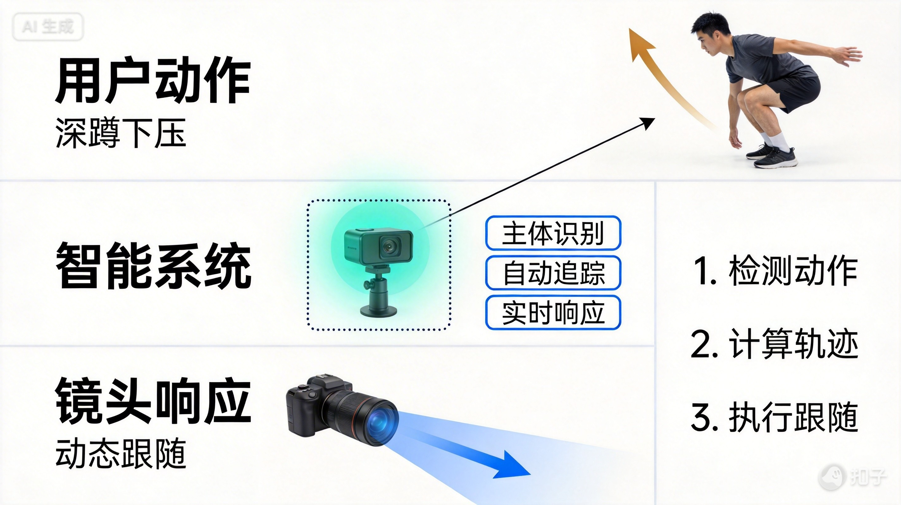

# AI Watermark Remover

🎨 Professional watermark removal toolkit using advanced inpainting techniques for AI-generated images.

[](https://www.python.org/downloads/)
[](https://opencv.org/)
[](LICENSE)

## ✨ Features

- 🎯 **Automatic Detection**: Detect common watermark positions (corners, center)
- ✏️ **Manual Selection**: Specify exact watermark area with coordinates
- 🔧 **Multiple Methods**: Inpainting, content-aware fill, patch-based removal
- 📦 **Batch Processing**: Process multiple images at once
- 🎨 **Quality Preservation**: Maintain original image quality
- 📁 **Format Support**: JPG, PNG, WebP, TIFF

## 🚀 Quick Start

### Installation

```bash
# Clone the repository
git clone https://github.com/howillli/ai-watermark-remover.git
cd ai-watermark-remover

# Install dependencies
pip install opencv-python opencv-contrib-python numpy pillow

# Or use the install script
bash install.sh
```

### Basic Usage

#### Remove Corner Watermark

```bash
python scripts/remove_watermark.py input.jpg --position topleft
```

#### Remove Custom Area Watermark

```bash
python scripts/remove_watermark.py input.jpg --area 1500,50,400,100
```

#### Batch Remove Watermarks

```bash
python scripts/batch_remove_watermarks.py /path/to/images --position bottomright
```

## 📸 Examples

### Example 1: Removing "AI Generated" Watermark

**Before:**


**After:**


**Command:**
```bash
python scripts/remove_watermark.py example1.jpg --position topleft --size medium --method telea --radius 15 --padding 30
```

---

### Example 2: Removing Multiple Watermarks

**Before:**



**After:**


**Command:**
```bash
# Step 1: Remove top-left watermark
python scripts/remove_watermark.py example2.jpg --position topleft --method telea --radius 15 --padding 30 --output example2_step1.jpg

# Step 2: Remove bottom-right watermark
python scripts/remove_watermark.py example2_step1.jpg --position bottomright --method telea --radius 15 --padding 30 --output example2_clean.jpg
```

## 📖 Usage Guide

### Position-Based Removal

Remove watermark from common positions:

```bash
# Bottom right corner (most common)
python scripts/remove_watermark.py image.jpg --position bottomright

# Top left corner
python scripts/remove_watermark.py image.jpg --position topleft

# Center
python scripts/remove_watermark.py image.jpg --position center
```

**Available positions:**
- `topleft`, `top`, `topright`
- `left`, `center`, `right`
- `bottomleft`, `bottom`, `bottomright`

### Area-Based Removal

Specify exact coordinates (x, y, width, height):

```bash
python scripts/remove_watermark.py image.jpg --area 1500,50,400,100
```

### Interactive Selection

Select watermark area visually:

```bash
python scripts/remove_watermark_interactive.py image.jpg
```

**Controls:**
- Click and drag to select area
- Press ENTER to confirm
- Press ESC to cancel
- Press R to reset selection

## 🛠️ Removal Methods

### Method 1: Inpainting (Default)

Best for: Text watermarks, simple overlays

```bash
python scripts/remove_watermark.py image.jpg --position bottomright --method inpaint
```

**Pros:** Fast, good for text  
**Cons:** May blur complex patterns

### Method 2: Telea (Content-Aware)

Best for: Complex backgrounds, photographic images

```bash
python scripts/remove_watermark.py image.jpg --position bottomright --method telea
```

**Pros:** Better for complex backgrounds  
**Cons:** Slower processing

### Method 3: Patch-Based

Best for: Large watermarks, repetitive patterns

```bash
python scripts/remove_watermark.py image.jpg --position bottomright --method patch
```

**Pros:** Best quality for large areas  
**Cons:** Slowest processing

## ⚙️ Advanced Options

### Adjust Inpainting Radius

```bash
# Larger radius for bigger watermarks
python scripts/remove_watermark.py image.jpg --position bottomright --radius 10
```

### Preserve Image Quality

```bash
# Use lossless output
python scripts/remove_watermark.py image.jpg --position bottomright --quality 100
```

### Custom Output Location

```bash
python scripts/remove_watermark.py image.jpg --position bottomright --output clean_image.jpg
```

### Watermark Size

```bash
# For position-based removal, specify watermark size
python scripts/remove_watermark.py image.jpg --position bottomright --size large
```

**Available sizes:**
- `small` - 200x60px
- `medium` - 400x100px (default)
- `large` - 600x150px

## 📊 Performance

**Processing speed** (approximate):
- Small watermark (100x50px): 0.5-1 second
- Medium watermark (400x100px): 1-2 seconds
- Large watermark (800x200px): 3-5 seconds

**Batch processing:**
- 100 images: ~2-5 minutes (depending on watermark size)

## 💡 Tips for Best Results

1. **Use high-resolution images**: Better quality input = better output
2. **Precise selection**: Select only the watermark area, not extra space
3. **Choose right method**: 
   - Text watermarks → `inpaint`
   - Photo backgrounds → `telea`
   - Large areas → `patch`
4. **Adjust radius**: Increase for larger watermarks
5. **Check preview**: Always preview before batch processing

## 🔧 Troubleshooting

### Watermark not fully removed

**Solution:** Increase `--radius` or `--padding`

```bash
python scripts/remove_watermark.py image.jpg --position bottomright --radius 20 --padding 40
```

### Blurry result

**Solution:** Use `--method telea` or `--method patch`

```bash
python scripts/remove_watermark.py image.jpg --position bottomright --method telea
```

### Color mismatch

**Solution:** Increase selection area to include more context

```bash
python scripts/remove_watermark.py image.jpg --position bottomright --size large
```

## 📁 Project Structure

```
ai-watermark-remover/
├── scripts/
│   ├── remove_watermark.py          # Main watermark removal script
│   ├── batch_remove_watermarks.py   # Batch processing script
│   ├── remove_watermark_interactive.py  # Interactive selection tool
│   └── create_test_image.py         # Create test images with watermarks
├── references/
│   └── ADVANCED_TECHNIQUES.md       # Advanced techniques documentation
├── examples/
│   ├── example1_with_watermark.jpg  # Example with watermark
│   ├── example1_clean.jpg           # Example after removal
│   ├── example2_with_watermark.jpg  # Example with multiple watermarks
│   └── example2_clean.jpg           # Example after removal
├── install.sh                       # Installation script
└── README.md                        # This file
```

## 🤝 Contributing

Contributions are welcome! Please feel free to submit a Pull Request.

1. Fork the repository
2. Create your feature branch (`git checkout -b feature/AmazingFeature`)
3. Commit your changes (`git commit -m 'Add some AmazingFeature'`)
4. Push to the branch (`git push origin feature/AmazingFeature`)
5. Open a Pull Request

## ⚖️ Legal Notice

This tool is intended for removing watermarks from your own AI-generated images or images you have rights to modify. Always respect copyright and usage rights.

## 📝 License

This project is licensed under the MIT License - see the [LICENSE](LICENSE) file for details.

## 🙏 Acknowledgments

- Built with [OpenCV](https://opencv.org/)
- Inpainting algorithms based on Telea and Navier-Stokes methods
- Inspired by the need for clean AI-generated images

## 📧 Contact

For questions or support, please open an issue on GitHub.

---

**Made with ❤️ for the AI community**
